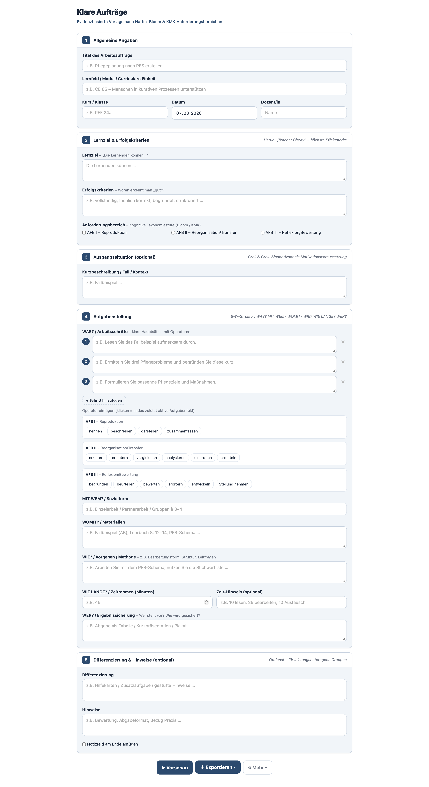
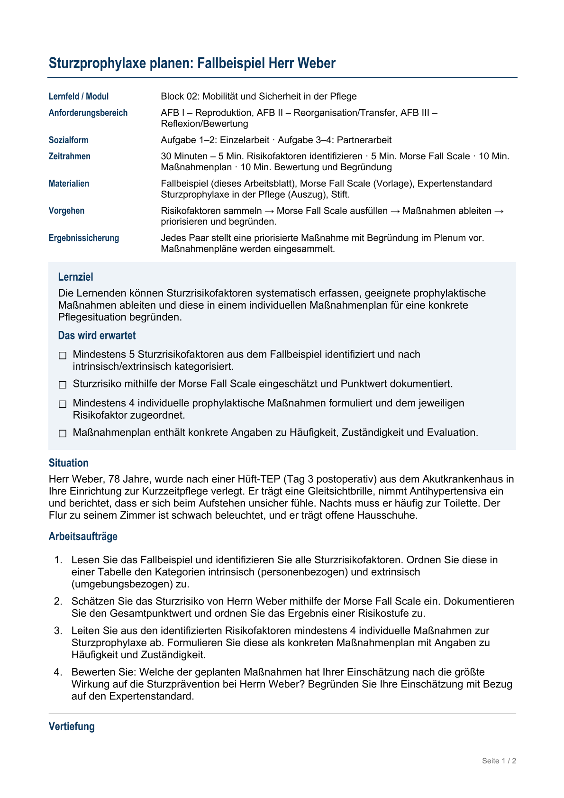

# Klare Aufträge

**Strukturierte Arbeitsaufträge erstellen – evidenzbasiert, exportierbar, offline**

Hier klicken zum Ausprobieren: [index.html](https://florianloyns.github.io/klare-auftraege/index.html)

---

> Ein schlankes Werkzeug für die Erstellung strukturierter Arbeitsaufträge – mit Word-Export, Operatoren-Bibliothek und didaktischer Grundstruktur nach Hattie und Bloom. Alles in einer einzigen HTML-Datei, ohne Installation, offline nutzbar.

---

## Inhalt

- [Worum geht es](#worum-geht-es)
- [Was es kann](#was-es-kann)
- [Struktur im Word-Export](#struktur-im-word-export)
- [Didaktische Grundlagen](#didaktische-grundlagen)
- [Schnellstart](#schnellstart)
- [Technisches](#technisches)

---

## Worum geht es

Hattie nennt es *Teacher Clarity* – wenn Lernende von Anfang an wissen, was sie lernen sollen, was erwartet wird und was sie konkret tun müssen, lernen sie besser. Klingt simpel, fehlt aber auf den meisten Arbeitsblättern.

Dieses Tool gibt eine Struktur vor, die das erzwingt: Lernziel und Erfolgskriterien stehen *vor* den Aufgaben, Operatoren werden bewusst gewählt, nichts Wesentliches wird vergessen.

## Was es kann

- **Word-Export** mit sauberem Layout (Lernziel-Block farblich hervorgehoben)
- **Operatoren-Bibliothek** nach AFB I–III per Klick einfügen
- **Schülerfreundliche Überschriften** im Export (auch für DaZ-Lernende verständlich)
- Arbeitsaufträge als **JSON speichern und wiederverwenden**
- Optionales Notizfeld am Ende

## Struktur im Word-Export

| Abschnitt | Wozu | Grundlage |
|---|---|---|
| Meta-Block | Lernfeld, Kurs, Datum, … | – |
| Lernziel | Was können die Lernenden danach? | Hattie: Teacher Clarity |
| Das wird erwartet | Erfolgskriterien als Checkliste | Hattie: Success Criteria |
| Situation | Fallbeispiel / Kontext | Grell & Grell |
| Arbeitsaufträge | Nummerierte Schritte mit Operatoren | Bloom / KMK |
| Vertiefung | Zusatzaufgabe (optional) | Differenzierung |
| Tipps | Hilfestellung zur Bearbeitung | Differenzierung |
| Notizen | Schreibfeld (optional) | – |

## Didaktische Grundlagen

**Hattie** – Teacher Clarity (d = 0.75): Lernziel und Erfolgskriterien explizit formulieren, damit Lernende den eigenen Lernfortschritt erkennen können.

**Bloom / KMK** – Operatoren nach Anforderungsbereichen I–III für die bewusste Wahl des kognitiven Niveaus: von Wiedergabe (AFB I) über Anwendung (AFB II) bis zur Beurteilung (AFB III).

**6-W-Methode** – WAS? MIT WEM? WOMIT? WIE? WIE LANGE? WER? – als strukturierende Rahmung für den Auftragskontext.

## Schnellstart

1. [`index.html`](index.html) herunterladen oder [online testen](https://florianloyns.github.io/klare-auftraege/index.html)
2. Im Browser öffnen – funktioniert lokal ohne Server
3. Ausfüllen, Vorschau prüfen, als Word exportieren

## Technisches

Eine einzelne HTML-Datei – kein Build, kein Framework, kein Server, keine externen Abhängigkeiten. Läuft vollständig im Browser, auch offline.

- Keine Datenübertragung, kein Tracking (DSGVO-konform)
- JSON-Export speichert Aufträge lokal – keine Daten verlassen das Gerät

---

**Weg vom Aufgabenzettel, hin zum durchdachten Arbeitsauftrag.**

---

## Impressum

Verantwortlich: Florian Loyns. Pflichtangaben nach § 5 DDG und Kontakt: [Impressum](https://florianloyns.github.io/Impressum/)

## Lizenz

[CC BY-NC-SA 4.0](https://creativecommons.org/licenses/by-nc-sa/4.0/deed.de) · Nutzen, anpassen und teilen – unter Namensnennung, nicht-kommerziell und unter gleichen Bedingungen.
